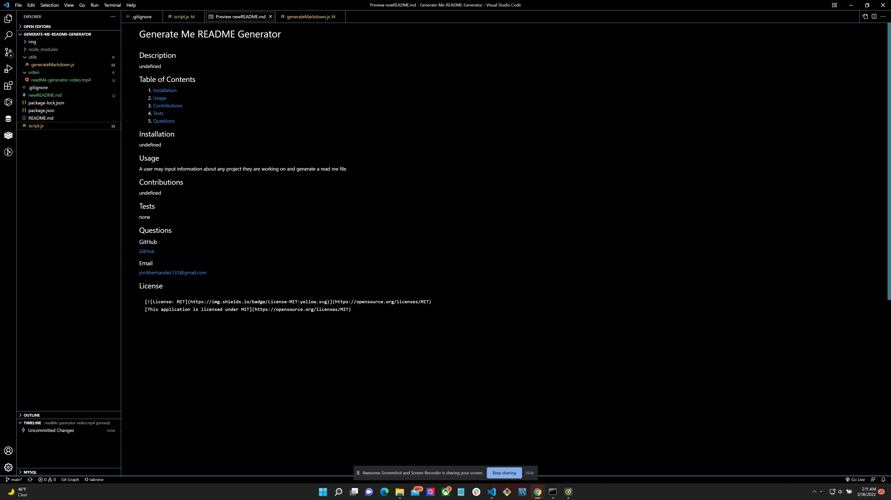
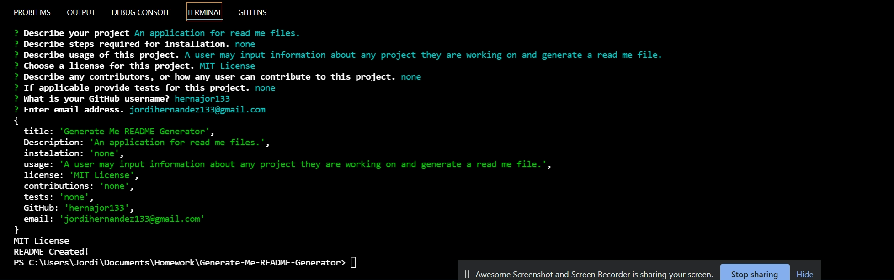

# Generate Me README Generator

## Description
A user may input information about any project they are working on and generate a read me file.
## Table of Contents
1. [Installation](#installation) 
2. [Usage](#usage)
3. [Contributions](#contributions)
4. [Tests](#tests)
5. [Questions](#questions)

## Usage 
AS A developer
I WANT a README generator
SO THAT I can quickly create a professional README for a new project

## Questions
GIVEN a command-line application that accepts user input
WHEN I am prompted for information about my application repository
THEN a high-quality, professional README.md is generated with the title of my project and sections entitled Description, Table of Contents, Installation, Usage, License, Contributing, Tests, and Questions
WHEN I enter my project title
THEN this is displayed as the title of the README
WHEN I enter a description, installation instructions, usage information, contribution guidelines, and test instructions
THEN this information is added to the sections of the README entitled Description, Installation, Usage, Contributing, and Tests
WHEN I choose a license for my application from a list of options
THEN a badge for that license is added near the top of the README and a notice is added to the section of the README entitled License that explains which license the application is covered under
WHEN I enter my GitHub username
THEN this is added to the section of the README entitled Questions, with a link to my GitHub profile
WHEN I enter my email address
THEN this is added to the section of the README entitled Questions, with instructions on how to reach me with additional questions
WHEN I click on the links in the Table of Contents
THEN I am taken to the corresponding section of the README
### GitHub
[GitHub](https://github.com/hernajor133) 
[GitHub-Repo](https://github.com/hernajor133/Generate-Me-README-Generator.git)

## Example ReadMe File

## Example Node.js

## Video
[video](https://drive.google.com/file/d/1s2LoeFS4fIADUyU7toG3grb0Jn9ycQ-S/view)
### Email
jordihernandez133@gmail.com
## License
    
    [This application is licensed under MIT](https://opensource.org/licenses/MIT)